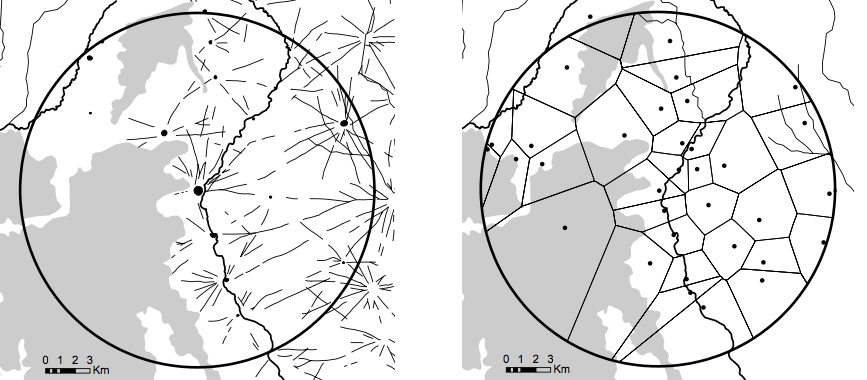
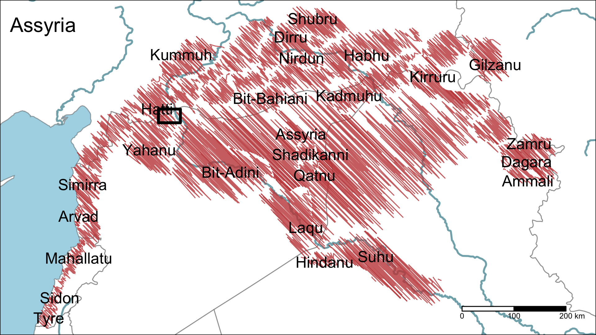
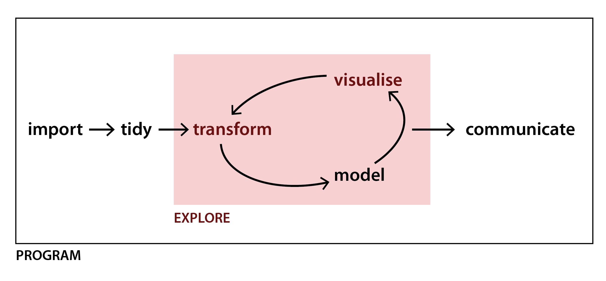
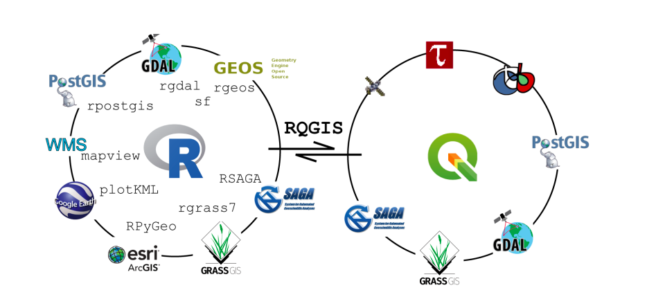

```{r xaringan-themer, include = FALSE}
library(xaringanthemer)
mono_light(
  base_color = "#204B53",
  text_bold_color = "#914646",
  #background_color = "white",
  header_font_google = google_font("Lato"),
  text_font_google   = google_font("Roboto", "400", "400"),
  code_font_google   = google_font("IBM Plex Mono"),
 # header_h2_font_size = 35,
  #header_h3_font_size = 10,

)

```


```{r setup, include=FALSE}
library(sf)
library(raster)
options(htmltools.dir.version = FALSE)
```

# Agenda

* Say Hello !

* Project

* Methodology

* Analytical Environment

* Exploratory Data Analysis: Land of Carchemish

* Next Steps

---
class: inverse, left, bottom

# Say Hello !

---
class: center, middle

```{r, echo=FALSE, out.height=450, out.width= 700, fig.cap="work/fun balance", fig.align='center'}
knitr::include_graphics("https://function.xkcd-excuse.com/media/47495320414e414c595354-4152434d4150204953204e4f5420524553504f4e44494e47-52455354415254494e47.png")
```

---

class: inverse, left, bottom

# Project

---
class: left, top

# Structural change

```{r, echo=FALSE, out.width= 600, fig.cap="Spatial changes in landscape are showing shift from nucleated to dispersed settlement pattern", fig.align='center'}

```

---
class: left, top

# Where ?

```{r, echo=FALSE, out.width= 600, fig.cap="Politcal landscape of the northern Fertile Crescent at the beginning of the 9th century BCE - after (Baudains et al. 2015).", fig.align='center'}

```

---
# When ?

* Southern Palestine - 1200 BCE

* Jazireh - 800 BCE

* Northern Levant - 300 BCE

* Upper Euphrates - 400 - 600 CE

---
# Objectives for now ...


* What is the timing of the ‘Great Dispersal’ across the Northern Fertile Crescent?

* Was there one dispersal or many ‘dispersals’? Are these events interrelated?

* What are the processes underpinning the change?

* What are the long-term settlement trajectories in the Northern Fertile Crescent from the Iron Age to the Late Islamic period?

---

class: inverse, left, bottom

# Methodology

---
# How ?

_‘The question then becomes how best to mine, mix and otherwise analyse a potential embarrassment of riches’_ (Bevan, 2015)

* deluge of legacy surveys built upon **Fragile Crescent** and **CLaSS** project database
* Data Science paradigm:

  - Literate Programming (Knuth, 1983)
  
  - Open Science: open access + open methods + open data (Marwick et al, 2017)
  
  - Tool Driven Revolution (Marwick and Shmidt, 2019)

* tools of trade: PostGIS, SQL, R, QGIS, GRASS, WhiteboxTools, Git and Github
---
class: middle, center
###Geographic Data Science

_'a set of statistical, computational, and analytical techniques and workflows; the set of of interconnected tools developed with such applications in mind; as well as the particular epistomological perspective that sustains these practise'_ 
  
  (Singleton and Arribas-Brl, 2019)

---
class: middle, center

```{r, echo=FALSE, out.width= 600, fig.cap="Data Science pipeline - a sequence of processing and analysing steps - is the core of project methodological framework (Grolemund and Wickham 2017).", fig.align='center'}

```

---
class: middle, center
###Literate Programming

_'By coining the phrase “literate programming”, I am imposing a moral commitment on everyone who hears the term; surely nobody wants to admit writing an illiterate program'_

Donald E. Knuth
---

#Ecosystem

```{r, echo=FALSE, out.width= 600, fig.cap="State of the art in coupling R language and GIS software (Muenchow,Schratz and Brenning, 2017)", fig.align='center'}

```


---
layout: false
class: inverse, middle, center

## Thank you

### Me:

@topographos2

michal.m.michalski@durham.ac.uk

### Website:

topographos.rbind.io

dispersal.rbind.io


